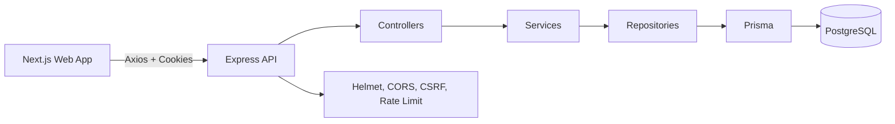

# Architecture

The backend follows controller, service, repository, middleware, validation, and configuration layers. Controllers translate HTTP concerns, services own business rules, and repositories own Prisma access.

The frontend uses feature folders for auth, dashboard, boards, and profile. TanStack Query is available for server state, Zustand owns lightweight UI state, and Framer Motion powers the animated galaxy interface.
